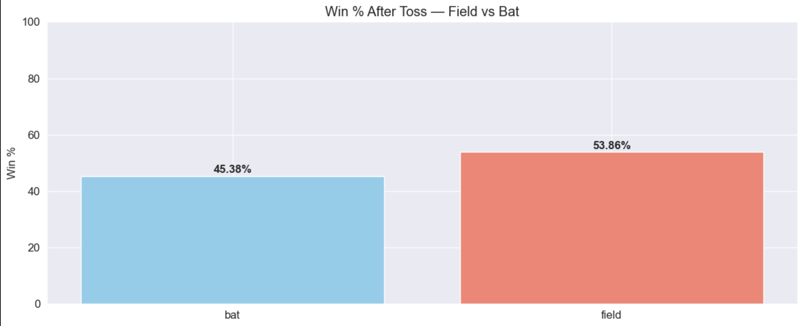

<div align="center">


<br/>

[](https://python.org)
[](https://pandas.pydata.org)
[](https://sqlite.org)
[](https://public.tableau.com)
[](https://jupyter.org)
[](https://github.com)

<br/>

> **End-to-end data analysis project** covering batting, bowling, team performance, toss impact, venue stats, and season trends across 17 IPL seasons using Python, SQL, and Tableau.

</div>

---

## ⚡ Project Stats

<div align="center">

| 🏟️ Matches | 🎯 Deliveries | 📅 Seasons | 🏏 Teams | 🔧 Tools Used |
|:-----------:|:-------------:|:----------:|:--------:|:-------------:|
| **816** | **179,078** | **17** | **15+** | **6** |

</div>

---

## 🗺️ Workflow

<div align="center">

```
📥 Raw CSVs  →  🗄️ SQLite DB  →  🔍 SQL Queries  →  📊 Python EDA  →  📈 Tableau Dashboard
```

</div>

| Step | What Happened |
|------|--------------|
| **01 · Load** | Loaded `matches.csv` and `deliveries.csv` into Pandas DataFrames |
| **02 · Store** | Pushed both tables into a SQLite database (`ipl.db`) using `sqlite3` |
| **03 · Query** | Wrote 7+ SQL queries — top scorers, team wins, toss impact, venue stats |
| **04 · EDA** | Built 8 visualizations using Matplotlib & Seaborn |
| **05 · Dashboard** | Built interactive Tableau dashboard with 5 chart sheets |

---

## 🛠️ Tech Stack

<div align="center">

| Tool | Role |
|------|------|
| `Python 3.10+` | Core analysis language |
| `Pandas` | Data loading, cleaning, transformation |
| `SQLite + sqlite3` | Relational database & SQL querying |
| `Matplotlib + Seaborn` | Static visualizations |
| `Tableau Public` | Interactive dashboard |
| `Jupyter Notebook` | Development & documentation |

</div>

---

## 📂 Project Structure

```
📁 IPL Data Analysis/
│
├── 📓 IPL Data Analysis.ipynb     ← Main notebook (EDA + analysis)
│
├── 📁 raw data/
│   ├── matches.csv                 ← 816 matches, 18 columns 
│   └── deliveries.csv              ← 179,078 rows, 21 columns
│
├── 📁 charts/
│   ├── top_10_run_scorer.png
│   ├── Most_wins_by_team.png
│   ├── Season_wise_total_runs.png
│   ├── virat_kohli_season_wise_analysis.png
│   ├── top_10_wicket_takers.png
│   ├── toss_impact.png
│   └── avg_runs_per_over.png
│
├── 📁 Tableau_data/
│   ├── tableau_top_batsmen.csv
│   ├── tableau_team_wins.csv
│   ├── tableau_season_runs.csv
│   ├── tableau_top_bowlers.csv
│   ├── tableau_toss_impact.csv
│   ├── tableau_venues.csv
│   ├── tableau_potm.csv
│   └── tableau_kohli.csv
│
├── 📄 README.md
└── 📄 .gitignore
```

---

## 📊 Visualizations

### 🏏 Top 10 Run Scorers — All Time


---

### 🏆 Most Wins by Team


---

### 📈 Season-wise Run Trends (2008–2020)


---

### 👑 Virat Kohli — Year-wise Performance


---

### 🎳 Top 10 Wicket Takers


---

### 🪙 Toss Decision Win Impact


---

### ⚡ Average Runs per Over (Powerplay vs Death)


---

## 🖥️ Tableau Dashboard


<div align="center">

### 🔗 [View Live Interactive Dashboard →](https://public.tableau.com)
*(replace with your Tableau Public link)*

</div>

---

## 💡 Key Insights

<details>
<summary><b>🏏 Batting Analysis</b></summary>
<br/>

- **Virat Kohli** is the all-time leading run scorer with **8,000+ runs** across 2008–2024, peaking in **2016 with 973 runs** — the highest ever by any batsman in a single IPL season
- Top 3 batsmen — Kohli, Dhawan and Sharma — together account for roughly **18% of all IPL runs** scored across 17 seasons
- Strike rates above **130+** are consistent among top 10 scorers, showing T20 demands both volume and pace

</details>

<details>
<summary><b>🎳 Bowling Analysis</b></summary>
<br/>

- **Y Chahal** leads all wicket takers with **200+ wickets**, followed by DJ Bravo and PP Chawla
- Spinners dominate the middle overs (7–15); wrist spinners (leg breaks, googlies) take a disproportionately higher share vs off-spinners
- Economy rate matters more than wickets in T20 — top bowlers maintain under 7.5 runs/over

</details>

<details>
<summary><b>🏆 Team Performance</b></summary>
<br/>

- **Mumbai Indians** are the most successful franchise with **140+ wins** — the only team to win the IPL 5 times
- **Chennai Super Kings** remain second-most successful despite a **2-year ban (2016–2017)**
- No team has won **3 consecutive titles** — confirming the IPL as one of the most competitive T20 leagues globally

</details>

<details>
<summary><b>🪙 Toss & Match Conditions</b></summary>
<br/>

- Teams winning the toss and choosing to **field win ~52–54%** of matches — chasing is a consistent advantage in T20
- Advantage is more pronounced at **Wankhede** and **Eden Gardens** due to evening dew affecting bowlers
- Bat-first teams rely heavily on setting 170+ totals to win; below that, the chasing team wins ~65% of the time

</details>

<details>
<summary><b>📈 Over-by-Over Breakdown</b></summary>
<br/>

- **Powerplay (overs 1–6)** and **Death overs (16–20)** average **8–10 runs/over**
- **Middle overs (7–15)** drop to **6–7 runs/over** as batsmen consolidate
- **Over 19** consistently produces the most runs per match across all 13 seasons

</details>

<details>
<summary><b>❌ Dismissal Patterns</b></summary>
<br/>

- **Caught** is the most common dismissal at **60%+**, followed by Bowled (~15%) and LBW (~10%)
- **Run outs spike in overs 18–20**, confirming aggressive high-risk running in death overs
- Stumped dismissals are almost exclusively in middle overs — a direct effect of spinners bowling

</details>

<details>
<summary><b>🏟️ Venue Analysis</b></summary>
<br/>

- **Wankhede Stadium (Mumbai)** and **Eden Gardens (Kolkata)** host the most matches across all seasons
- Home ground advantage is real — home teams win approximately **55% of matches** at their venues
- Flat pitches (Wankhede, Chinnaswamy) consistently produce higher scores vs bowler-friendly venues

</details>

---

## 🚀 Run It Locally

```bash
# Clone the repository
git clone https://github.com/yourusername/ipl-data-analysis.git
cd ipl-data-analysis

# Install dependencies
pip install pandas matplotlib seaborn

# Launch Jupyter
jupyter notebook ipl_analysis.ipynb
```

---

## 👤 About Me

<div align="center">

**Ram (Ramesha Gangadharappa)**
B.Tech Data Science · NHCE Bengaluru · Graduating 2028

[](https://www.instagram.com/decoder_space/?hl=en)
[](https://www.youtube.com/@The_Decoder_yt)
[]((https://www.linkedin.com/in/ramesha-g/))
[](https://github.com/your-username)

</div>

---

<div align="center">


*Built with Python, SQL, and a lot of cricket knowledge 🏏*

</div>
